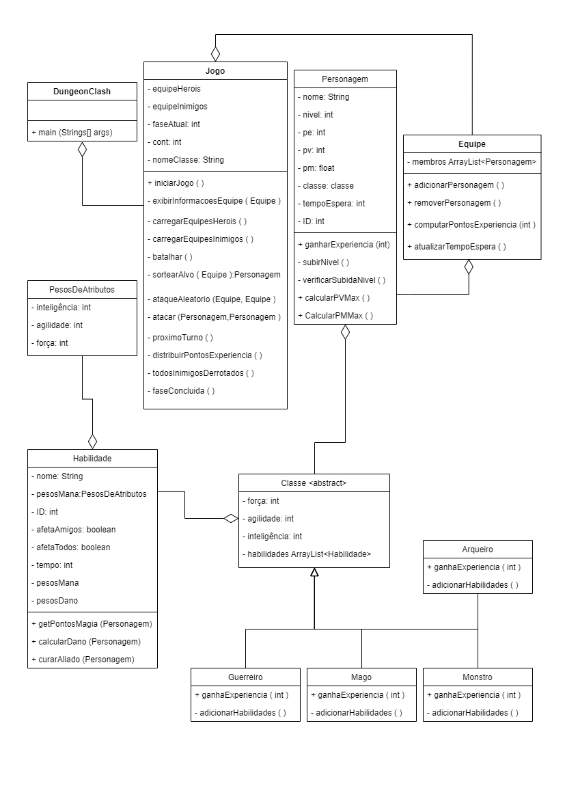

# Dungeon Clash RPG

RPG games are quite popular, especially after the emergence of Dungeons & Dragons in the 1970s. Inspired by these types of games, Dungeon Clash is created with the aim of providing a practical programming experience for students in the OOP discipline. The game proposes an RPG adventure to be played in teams. A team of characters, with different abilities, can be assembled to complete challenges, facing ogres, trolls, goblins, zombies, etc.

The dynamics of the game are simple and consist of a series of steps, with battles occurring in each of them. In this confrontation, characters are characterized by different classes that determine their abilities, level progression and use of items. Each character is identified by their name, class and level; and also has three main attributes: physical strength (attack and endurance capacity), agility (attack speed and dodge) and intelligence (use and resistance to magic), which vary according to the class. They will also have hit points (PV), magic points (PM) and experience points (PE). As per the table below, the initially available classes are archer, warrior, mage and monster, each with their own abilities, initial attributes and evolution detailed in specific tables. New classes may be introduced in the future and the attributes of each class may be adjusted to balance the battles.

## Character Classes

| Archer | Warrior | Mage | Monster |
|---|---|---|---|
|Your arrows deal less damage than a warrior's sword, but they have the ability to attack swiftly! Easily dodges attacks.|Great in armed melee attacks. Has average brute strength for unarmed attacks. Their endurance is excellent!|Mages can cast spells and, with the use of items, enhance their abilities.|Great physical strength. Dumb as a door. Unable to use magic.|
|At each level, gains 3 points of agility, 2 of intelligence, and 1 of strength.|At each level, gains 4 points of strength, 1 of agility, and 1 of intelligence.|At each level, gains 3 points of intelligence, 1 of strength, and 2 of agility.|At each level, gains 4 points of strength and 1 point of agility.|

### Archer

|Ability|Damage|Cooldown Time (units)|Target|Magic Points|
| --- | --- | --- | --- | --- |
|Punch|level&ast;*Math.ceil*(agility&ast;0.1+strength&ast;0.3)|3|Single|0|
|Shoot Arrow|level&ast;*Math.ceil*(strength&ast;0.3+agility&ast;0.5)|4|Single|0|
|Enchanted Arrow|level&ast;*Math.ceil*(strength&ast;0.3+agility&ast;0.5+intelligence&ast;0.4)|7|Single|level&ast;*Math.ceil*(intelligence+agility&ast;0.2)|

### Warrior

|Ability|Damage|Cooldown Time (units)|Target|Magic Points|
| --- | --- | --- | --- | --- |
|Punch|level&ast;*Math.ceil*(agility&ast;0.1+strength&ast;0.3)|4|Single|0|
|Sword Strike|level&ast;*Math.ceil*(agility&ast;0.3+strength&ast;0.7)|5|Single|0|
|Flaming Sword|level&ast;*Math.ceil*(strength&ast;0.3+agility&ast;0.5+intelligence&ast;0.4)|7|Single|level&ast;*Math.ceil*(intelligence+strength&ast;0.2)|

### Mage

|Ability|Damage|Cooldown Time (units)|Target|Magic Points|
| --- | --- | --- | --- | --- |
|Punch|level&ast;*Math.ceil*(agility&ast;0.1+strength&ast;0.1)|2|Single|0|
|Weaken|level&ast;*Math.ceil*(agility&ast;0.2+strength&ast;0.3+intelligence&ast;0.5)|5|Single|level&ast;*Math.ceil*(intelligence&ast;0.5)|
|Heal Ally|level&ast;*Math.ceil*(agility&ast;0.2+strength&ast;0.5+intelligence&ast;0.8)|4|Single(Ally)|level&ast;*Math.ceil*(intelligence&ast;0.7)|

### Monster

|Ability|Damage|Cooldown Time (units)|Target|Magic Points|
| --- | --- | --- | --- | --- |
|Punch|level&ast;*Math.ceil*(agility&ast;0.4+strength&ast;0.8)|5|Single|0|
|Kick|level&ast;*Math.ceil*(agility&ast;0.5+strength&ast;1.0)|8|Single|0|
|Stunning Shout|level&ast;*Math.ceil*(agility&ast;0.2+strength&ast;0.4)|6|All|0|

## Hit Points, Magic Points and Experience Points

The hit points (PV) of a character define their resistance to blows. The magic points allow the character to use spells using these points. Below is the definition of maximum PV and PM:

**PVmax = level * strength + (level * agility / 2)**

**PMmax = level * intelligence + (level * agility / 3)**

Experience points (PE) are used to make a character level up. At each level, the experience points return to zero and more points are needed to level up. PE increases when an enemy character is defeated, by the following equation:

**PE += defeated opponent's level * 5**

To level up, a specific amount of PE is required, defined by the formula:

**PE** required to **level up = current level * 25**

## Battles

It should be possible to engage in a battle between a maximum of 3 hero characters against *n* enemies. The three heroes must be chosen by the user, from warrior, archer and mage. The user should input the name and choose the class. Enemies can have any class and will initially be controlled by the user (there is no need to implement AI to control the enemies).

Upon starting the battle, the game should display the information of both teams, including ID, name, Class, PV, PM, Character Level and cooldown time. At time zero, at the beginning of the game, all characters will have a cooldown time of zero. Therefore, everyone has a chance to attack at this moment. Thus, it should be determined randomly which character attacks first.

When choosing which character attacks, the list of their abilities should be displayed, including the name, PM required, damage dealt, cooldown time caused by it and who/how many it affects. Since each ability has a cooldown time, when a character attacks, their cooldown time will be adjusted to the time of the used ability. They should refrain from attacking until their cooldown time reaches zero again. Each turn, the cooldown time is reduced by 1. If no one can attack, everyone's cooldown time is reduced by one and the turn passes without anyone attacking until someone reaches zero cooldown time. Silent turns do not need to be notified on the screen. If, by chance, two or more characters can attack at the same instant, a random draw is made to decide which of them will attack first.

Once stunned (PV = 0), a character cannot attack. **Experience points** go to **all members of the winning team**, including those who end up stunned. 

## Game File (jogo.txt)

Through a file called jogo.txt, the enemy teams and a description of the stage will be defined, where each set of these defines a stage of the game. The format of the file will be:

```
<NomeDoInimigo1> <ClasseDoInimigo1> <NívelDoInimigo1>
<NomeDoInimigo2> <ClasseDoInimigo2> <NívelDoInimigo2>
...
<NomeDoInimigoN> <ClasseDoInimigoN> <NívelDoInimigoN>
fase Descrição da fase 1
<NomeDoInimigo1> <ClasseDoInimigo1> <NívelDoInimigo1>
<NomeDoInimigo2> <ClasseDoInimigo2> <NívelDoInimigo2>
...
<NomeDoInimigoN> <ClasseDoInimigoN> <NívelDoInimigoN>
fase Descrição da fase 2
```

Every time the word "fase" is encountered in the jogo.txt file, the list of enemies is closed to initiate a battle. This way, it's possible to create *n* battles in a game, with enemies of various classes and levels in each battle. Care should be taken not to include the quantity and level of enemies that do not match the level of the allies. Tests should be conducted to ensure the balance of each battle.

## Diagram

In the context of the RPG game, the class diagram represents the main classes of the system, such as Jogo, Archer, Warrior, Mage, Monster, AttributeWeights and Character, along with their attributes and methods.

Additionally, the diagram shows the inheritance relationships between the classes, indicating which classes inherit attributes and methods from others. For example, the Warrior, Mage and Monster classes inherit attributes and methods from the Class class.

The class diagram also represents associations between classes, such as the association between Character and Class, indicating that a character has a class associated with it.

In summary, the class diagram offers a structured and organized view of the system, allowing for a clear understanding of the classes and their relationships, which is fundamental for the development and maintenance of the game system.



## How to Play?

1. Make sure you have installed Java version 21 or newer. To check the version your computer has, use the command "java -version" in your operating system's command prompt.
2. Install an IDE of your preference that is capable of working with the Java programming language. IntelliJ IDEA, NetBeans, Visual Studio Code are examples of some free IDEs available on the internet.
3. Open the IDE, open the "2023-POO-DungeonClashRPG" project, compile the Dungeon Clash file, and run the code.

## Final Notes

The project defines a minimum set of classes, which must be implemented according to the following descriptions. If necessary, it is possible to use other object classes, as long as they do not alter the project's conception defined by the minimum set of classes.

# [PT-BR] Dungeon Clash RPG

Jogos RPG são bastante populares, especialmente depois do surgimento do Dungeons & Dragons na década de 70. Inspirado por estes tipos de jogos, surge o Dungeon Clash, criado com o objetivo de oferecer uma vivência prática de programação para os alunos da disciplina de POO. O jogo propõe uma aventura RPG para ser jogada em equipe. Um time de personagens, com diferentes habilidades, pode ser montado para concluir desafios, enfrentando ogros, trolls, gobblings, zumbis, etc.

A dinâmica do jogo é simples e consiste de uma série etapas, sendo que em cada uma delas batalhas irão acontecer. Neste confronto, os personagens são caracterizados por diferentes classes que determinam suas habilidades, progressão de níveis e uso de itens. Cada personagem é identificado pelo seu nome, classe e nível, além de possuir três atributos principais: força física (capacidade de ataque e resistência), agilidade (velocidade de ataque e esquiva) e inteligência (uso e resistência a magias), os quais variam de acordo com a classe. Eles terão também pontos de vida (PV), pontos de magia (PM) e pontos de experiência (PE). Conforme o quadro abaixo, as classes disponíveis inicialmente são arqueiro, guerreiro, mago e monstro, cada uma com suas próprias habilidades, atributos iniciais e evolução detalhados em tabelas específicas. Novas classes podem ser introduzidas no futuro, e os atributos de cada classe podem ser ajustados para equilibrar as batalhas.

## Classes dos personagens

| Arqueiro | Guerreiro | Mago | Monstro |
|---|---|---|---|
|Suas flechas causam menos dano que a espada de um guerreiro, mas tem a capacidade de atacar de forma ágil! Desvia facilmente de ataques.|Ótimo em ataques corpo a corpo armado. Tem média força bruta para ataque desarmado. Sua resistência é ótima!|Magos podem lançar magias e com o uso de itens, aumentam suas habilidades.|Grande força física. Burro como uma porta. Incapaz de usar magia.|
|A cada nível, ganha 3 pontos de agilidade, 2 de inteligência e 1 de força.|A cada nível ganha 4 pontos de força, 1 de agilidade e 1 de inteligência.|A cada nível, ganha 3 pontos de inteligência, 1 de força e 2 de agilidade.|A cada nível, ganha 4 pontos de força e 1 ponto de agilidade.|

### Arqueiro

|Habilidade|Dano|Tempo de Descanso (unidades)|Alvo|Pontos de Magia|
| --- | --- | --- | --- | --- |
|Socar|nível&ast;*Math.ceil*(agilidade&ast;0.1+força&ast;0.3)|3|Único|0|
|Atirar Flecha|nível&ast;*Math.ceil*(força&ast;0.3+agilidade&ast;0.5)|4|Único|0|
|Flecha Encantada|nível&ast;*Math.ceil*(força&ast;0.3+agilidade&ast;0.5+inteligência&ast;0.4)|7|Único|nível&ast;*Math.ceil*(inteligência+agilidade&ast;0.2)|

### Guerreiro

|Habilidade|Dano|Tempo de Descanso (unidades)|Alvo|Pontos de Magia|
| --- | --- | --- | --- | --- |
|Socar|nível&ast;*Math.ceil*(agilidade&ast;0.1+força&ast;0.3)|4|Único|0|
|Golpe de Espada|nível&ast;*Math.ceil*(agilidade&ast;0.3+força&ast;0.7)|5|Único|0|
|Espada Flamejante|nível&ast;*Math.ceil*(força&ast;0.3+agilidade&ast;0.5+inteligência&ast;0.4)|7|Único|nível&ast;*Math.ceil*(inteligência+força&ast;0.2)|

### Mage

|Habilidade|Dano|Tempo de Descanso (unidades)|Alvo|Pontos de Magia|
| --- | --- | --- | --- | --- |
|Punch|nível&ast;*Math.ceil*(agilidade&ast;0.1+força&ast;0.1)|2|Único|0|
|Weaken|nível&ast;*Math.ceil*(agilidade&ast;0.2+força&ast;0.3+inteligência&ast;0.5)|5|Único|nível&ast;*Math.ceil*(inteligência&ast;0.5)|
|Heal Ally|nível&ast;*Math.ceil*(agilidade&ast;0.2+força&ast;0.5+inteligência&ast;0.8)|4|Único(Ally)|nível&ast;*Math.ceil*(inteligência&ast;0.7)|

### Monster

|Habilidade|Dano|Tempo de Descanso (unidades)|Alvo|Pontos de Magia|
| --- | --- | --- | --- | --- |
|Punch|nível&ast;*Math.ceil*(agilidade&ast;0.4+força&ast;0.8)|5|Único|0|
|Kick|nível&ast;*Math.ceil*(agilidade&ast;0.5+força&ast;1.0)|8|Único|0|
|Stunning Shout|nível&ast;*Math.ceil*(agilidade&ast;0.2+força&ast;0.4)|6|Todos|0|

## Pontos de vida, Magia e Experiência

Os pontos de vida (PV) de um personagem definem sua resistência a golpes. Os pontos de magia permitem ao personagem usar magias utilizando estes pontos. Abaixo, a definição de PV e PM máximos:

**PVmax = nível * força + (nível * agilidade/2)**

**PMmax = nível * inteligência + (nível * agilidade/3)**

Os pontos de experiência (PE) servem para fazer um personagem passar para o próximo nível. A cada nível os pontos de experiência voltam a zero e são necessários mais pontos para subir de nível. PE aumenta quando um personagem inimigo é derrotado, pela seguinte equação:

**PE += nível do adversário derrotado * 5**

Para subir de nível, é necessário ter uma quantia de PE específica, definida pela fórmula:

**PE** necessário para **subir de nível = nível atual * 25**

## Batalhas

Deve ser possível travar uma batalha entre, no máximo, 3 personagens heróis contra n inimigos. Os três heróis devem ser escolhidos pelo usuário, entre guerreiro, arqueiro e mago. O usuário deve digitar o nome e escolher a classe. Os inimigos podem ter qualquer classe e serão, inicialmente, controlados pelo usuário (não há necessidade de implementar uma IA para controlar os inimigos).

Ao iniciar a batalha, o jogo deve exibir as informações dos dois times, com ID, nome, Classe, PV, PM, Nível do personagem e tempo de espera. No momento zero, ao início do jogo, todos os personagens terão tempo de espera igual a zero. Dessa forma, todos tem uma chance de atacar nesse momento. Assim, deve-se sortear qual entre todos os personagens ataca primeiro.

Ao escolher qual personagem ataca, deve-se exibir a lista de suas habilidades, com nome, PM
necessário, dano que causa, tempo de espera que ela causa e quem/quantos ela afeta. Como cada habilidade tem um tempo de espera, quando um personagem ataca, seu tempo de espera será modificado para o tempo da habilidade usada. Ele deve ficar sem atacar até que seu tempo de descanso atinja zero (0) novamente. A cada turno, o tempo de descanso é reduzido em 1. Se ninguém puder atacar, o tempo de todos é reduzido em um e o turno se passa sem que ninguém ataque, até que alguém atinja tempo zero (0). Turnos silenciosos não precisam ser notificados na tela. Se por acaso dois ou mais personagens puderem atacar no mesmo instante, um sorteio é feito para decidir qual deles irá atacar primeiro.

Uma vez atordoado (PV = 0), um personagem não pode atacar. **Pontos de experiência** vão para **todos os membros do time vencedor**, incluindo aqueles que terminarem atordoados.

## Arquivo de Jogo (jogo.txt)

Através de um arquivo chamado jogo.txt serão definidas as equipes inimigas e uma descrição da fase, onde cada conjunto desses define uma etapa do jogo. O formato do arquivo será:

```
<NomeDoInimigo1> <ClasseDoInimigo1> <NívelDoInimigo1>
<NomeDoInimigo2> <ClasseDoInimigo2> <NívelDoInimigo2>
...
<NomeDoInimigoN> <ClasseDoInimigoN> <NívelDoInimigoN>
fase Descrição da fase 1
<NomeDoInimigo1> <ClasseDoInimigo1> <NívelDoInimigo1>
<NomeDoInimigo2> <ClasseDoInimigo2> <NívelDoInimigo2>
...
<NomeDoInimigoN> <ClasseDoInimigoN> <NívelDoInimigoN>
fase Descrição da fase 2
```

A cada vez que a palavra “fase” é encontrada no arquivo game.txt, a lista de inimigos é fechada para uma batalha ser travada. Dessa forma, é possível criar n batalhas em um jogo, com inimigos de diversas classes e níveis em cada batalha. Deve-se ter o cuidado de não colocar quantidade e nível dos inimigos que não condizem com o nível dos aliados. Testes devem ser feitos para conferir o balanceamento de cada batalha.

## Diagrama

No contexto do jogo de RPG, o diagrama de classes representa as classes principais do sistema, como Jogo, Arqueiro, Guerreiro, Mago, Monstro, PesosDeAtributos e Personagem, juntamente com seus atributos e métodos.

Além disso, o diagrama mostra as relações de herança entre as classes, indicando quais classes herdam atributos e métodos de outras. Por exemplo, as classes Guerreiro, Mago e Monstro herdam atributos e métodos da classe Classe.

Também é representada no diagrama de classes a associação entre as classes, como a associação entre Personagem e Classe, indicando que um personagem tem uma classe associada a ele.

Em resumo, o diagrama de classes oferece uma visão estruturada e organizada do sistema, permitindo uma compreensão clara das classes e seus relacionamentos, o que é fundamental para o desenvolvimento e a manutenção do sistema de jogo.


## Como Jogar?

1. Assegure-se de possuir instalada a versão 21, ou mais recente, do Java. Para verificar a versão que seu computador possui, utilize o comando “java –version” no prompt de comando do seu sistema operacional.
2. Instale uma IDE, de sua preferência, que seja capaz de trabalhar com a linguagem de programação Java. IntelliJ IDEA, NetBeans, Visual Studio Code são exemplos de algumas IDEs gratuitas encontradas na internet.
3. Abra a IDE, abra o projeto “2023-POO-DungeonClashRPG”, compile o arquivo Dungeon Clash e execute o código.

## Observações Finais

O projeto define um conjunto de classes mínimo, que devem ser implementadas conforme as descrições a seguir. Caso julgue necessário, é possivel utilizar outras classes de objetos, desde que elas não alterem a concepção do projeto definido pelo conjunto de classes mínimo.
